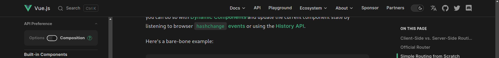

<script setup>
import button_count from './Vue/Button-count.vue'
</script>

# Introduction to Vue

::: danger Vue Docs by default show the Docs for Vue 2
Make sure that the toggle near the Vue logo is toggled to the Composition side to see the docs for Vue 3.

:::

## What is Vue
It is a Javascript framework which is used to build [single page application](https://www.youtube.com/watch?v=eIxDHgzGCnY).
Below is a example of a simple counter in vue. It has three parts:
1. script -> It contains the brain of the component meaning Java Script.
2. template -> It is the structure of the component meaning html.
3. style -> Well it is style so it is Css.

::: tip Scoping css to just One component
You can Just add scoped keyword after the style tag end to scope the css to just this component automatically.
```html
<style scoped>
```
:::
``` html {3,9-11}
<script setup>
import { ref } from 'vue'
const count = ref(0)
</script>

<template>
    <p>{{ count }}</p>
    <div>
        <button @click="count--">Decrease</Button>
        <button @click="count=0">Reset</Button>
        <button @click="count++">Increase</Button>
    </div>
</template>

<style>
p {text-align: center;}
div {text-align: center;}
button {
    width: 20%;
    border: 2px solid #d1d1d1;
    border-radius: 8px;
}
</style>
```

<button_count />

## Important things to learn in vue
* <h3>ref</h3>
[Docs Guide](https://vuejs.org/guide/essentials/reactivity-fundamentals.html#reactive-variables-with-ref)  
[Youtube Guide for Refs](https://www.youtube.com/watch?v=sAj6tdVS2cA)  
You have already seen a example of ref in the above code it just basically says that if the value inside the ref changes it will take care of updating it on the actual page.
```html
<script setup>
import { ref } from 'vue'
const count = ref(0)

function increment(){
    count.value++;
}
</script>
```
Here the count variable is a value which will automatically will be rendered on the page if it is there and it will reflect changes on the page as the value of the count variable is changing.<br/>
When you want to access the value of `{var} in the script tag you will have to use var_name.value` (because ref wraps the value passes to it in a object) `but inside the template tags (html part) you can just use the var_name`.<br/>

:::info
If you are wondering why we can change the value of count even though it is a const. It is because ref return a object and const Object can't change but the values inside the object can change.
:::
* <h3>@click ( or v-bind:click )</h3>
[Docs Guide](https://vuejs.org/guide/essentials/event-handling.html)  
[Youtube Guide for Click Events](https://vueschool.io/lessons/vue-fundamentals-capi-user-events-in-vue-3?friend=vuejs)  
As you ssw above @click is used to call a Javascript function or inline expression when a button or a element is clicked.
We can write the first expression as below as well with functions.
``` html
<script setup>
import { ref } from 'vue'
const count = ref(0)

function increment(){
    count.value++;
}

function reset(){
    count.value=0;
}

function decrement(){
    count.value--;
}
</script>

<template>
    <p>{{ count }}</p>
    <div>
        <button @click="decrement()">Decrease</Button>
        <button @click="reset()">Reset</Button>
        <button @click="increment()">Increase</Button>
    </div>
</template>

<style>
p {text-align: center;}
div {text-align: center;}
button {
    width: 20%;
    border: 2px solid #d1d1d1;
    border-radius: 8px;
}
</style>
```
* <h3>Vue Directives</h3>
[Docs Guide](https://vuejs.org/guide/essentials/conditional.html)  
[Video Guide](https://youtu.be/FXpIoQ_rT_c?t=742)  

General Recommendation Here is to watch the Vue Js directives part of the above video to understand how Vue directives are used. Honestly this part is better understood with video rather than blog.  

### Recommendation Resouces for tags
[Docs for V-if](https://vuejs.org/guide/essentials/conditional.html)  
[Video for v-if](https://vueschool.io/lessons/vue-fundamentals-capi-conditionals-in-vue?friend=vuejs)

[Docs for v-for](https://vuejs.org/guide/essentials/list.html)  
[Video for v-for](https://vueschool.io/lessons/vue-fundamentals-capi-list-rendering-in-vue?friend=vuejs)

[Docs for v-model](https://vuejs.org/guide/essentials/forms.html)  
[Video for v-model](https://vueschool.io/lessons/vue-fundamentals-capi-user-inputs-in-vue?friend=vuejs)

## Common Problems
* Javascript In the attributes with html
::: danger Question
Adding a class or a property or a url based on a variable in vue.
:::

::: tip Answer
You can put a ":" before the property which you want to javascript expression inside
Like the ":href" in the case below


[Docs Guide](https://vuejs.org/guide/essentials/class-and-style.html)  
[Youtube Guide](https://vueschool.io/lessons/vue-fundamentals-capi-dynamic-css-classes-with-vue?friend=vuejs)
:::

::: warning Example
```html
<script setup>
import { ref } from 'vue'
const url = ""
</script>

<template>
  <a :href="url"><h1>testing</h1></a>
</template>
```
:::
