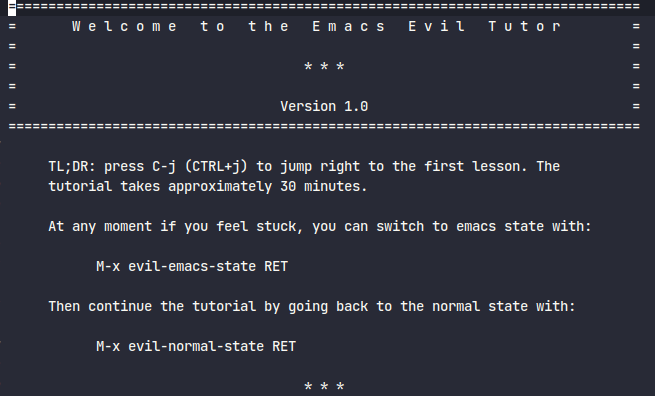

# {{ $frontmatter.title }}
::: warning
All the Blogs after Getting started assume that you are using the default config provided by this blog. -> [here](Installation/example.zip)
:::

## Keybinding Convention
Some conventions for emacs keybinding are given below  
`M-x` -> It means the `alt key with x`  
`C-x`-> It means to press the `ctrl key with x`  
`X` -> It is just press `Shift with x`  
`C-e C-c` -> It means to first press `ctrl with e` and then press `ctrl with c`  
::: tip
The keys which are seperated by a space you can press them one by one you `don't` need to press all of them at the same time.
:::
## Evil ( Or vim for emacs )
Doom emacs by default uses Vim keybinding.  
To learn about vim just just press `M-x` and then type evil-tutor-start and then press enter.  
It should open a guide like below

